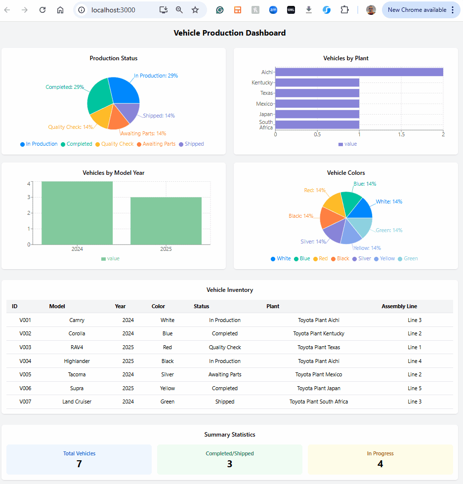

# Vehicle Production Dashboard

This project is an interactive dashboard that visualizes vehicle production data retrieved from Azure Cosmos DB. The dashboard displays vehicle production status, manufacturing plant distribution, model years, colors, and a detailed inventory table.

## Project Origin

This dashboard was created using an AI-driven workflow:

1. **Data Source**: Vehicle data stored in an Azure Cosmos DB instance, populated with sample data from the [vehicles.json](https://github.com/AzureCosmosDB/azure-cosmos-mcp-server/blob/main/dataset/vehicles.json) dataset
2. **Data Access**: Retrieved via the [Azure Cosmos DB MCP Server](https://github.com/AzureCosmosDB/azure-cosmos-mcp-server), a Model Context Protocol server that provides secure access to Cosmos DB datasets
3. **Dashboard Creation**: Generated by Claude AI Assistant inside Claude Desktop, which produced a React component visualization of the data
4. **Local Implementation**: Integrated into a local React application for standalone use

## Features

- **Production Status Breakdown**: Pie chart of vehicle manufacturing status
- **Plant Distribution**: Bar chart showing vehicle counts by manufacturing plant
- **Model Year Analysis**: Bar chart comparing 2024 vs 2025 model year counts  
- **Color Distribution**: Pie chart of vehicle colors
- **Complete Inventory Table**: Detailed table of all vehicle information
- **Summary Statistics**: Quick overview of key metrics

## Live Demo

The dashboard is available in two ways:

- **Claude Desktop Artifact**: [View the dashboard in Claude](https://claude.ai/public/artifacts/246aa594-bd7a-4eac-8b43-2e00d98d93f9)
- **Local Deployment**: Run your own instance using the instructions below



## Getting Started

### Prerequisites

- Claude Desktop installed (for the AI-assisted workflow)
- Azure Cosmos DB account (for data storage)
- Node.js and npm installed
- Basic knowledge of React

### Installation

1. Clone this repository

   ```bash
   git clone https://github.com/yourusername/vehicle-dashboard.git
   cd vehicle-dashboard
   ```

2. Install dependencies

   ```bash
   npm install
   ```

3. Start the development server

   ```bash
   npm start
   ```

4. Open [http://localhost:3000](http://localhost:3000) to view it in your browser

## Technical Details

### Architecture

This project demonstrates an AI-assisted full-stack workflow:

1. **Database Layer**: Azure Cosmos DB (NoSQL)
2. **Middleware**: Azure Cosmos DB MCP Server
3. **AI Processing**: Claude AI for data understanding and visualization
4. **Frontend**: React with Recharts for visualization

### Implementation Notes

- **Styling**: Uses Tailwind CSS via CDN for simplicity
- **Chart Library**: Recharts for responsive, interactive charts
- **Data Fetching**: Prefetched via MCP server, embedded in component for portability
- **Responsive Design**: Dashboard automatically adjusts to different screen sizes

### Simplified Tailwind Configuration

We opted for the Tailwind CDN approach for simplicity:

```html
<!-- In public/index.html -->
<script src="https://cdn.tailwindcss.com"></script>
```

This eliminates the need for complex local Tailwind configuration while still providing all styling capabilities.

## Future Enhancements

- Connect directly to live data sources
- Add filtering capabilities
- Implement time-series analysis of production trends
- Add export functionality for reports

## Related Projects

- [Azure Cosmos DB MCP Server](https://github.com/AzureCosmosDB/azure-cosmos-mcp-server): The server that enables secure access to Cosmos DB from AI assistants
- [Model Context Protocol](https://modelcontextprotocol.io/): The protocol that powers the connection between AI assistants and external tools

## License

This project is licensed under the MIT License - see the LICENSE file for details.

## Acknowledgements

- Claude AI Assistant for generating the dashboard visualization
- Microsoft Azure for the Cosmos DB platform
- Recharts for the charting library
- The React team for the application framework

---

*Note: This dashboard was created as a demonstration of AI-assisted data visualization. The vehicle data is fictional and used for demonstration purposes only.*
